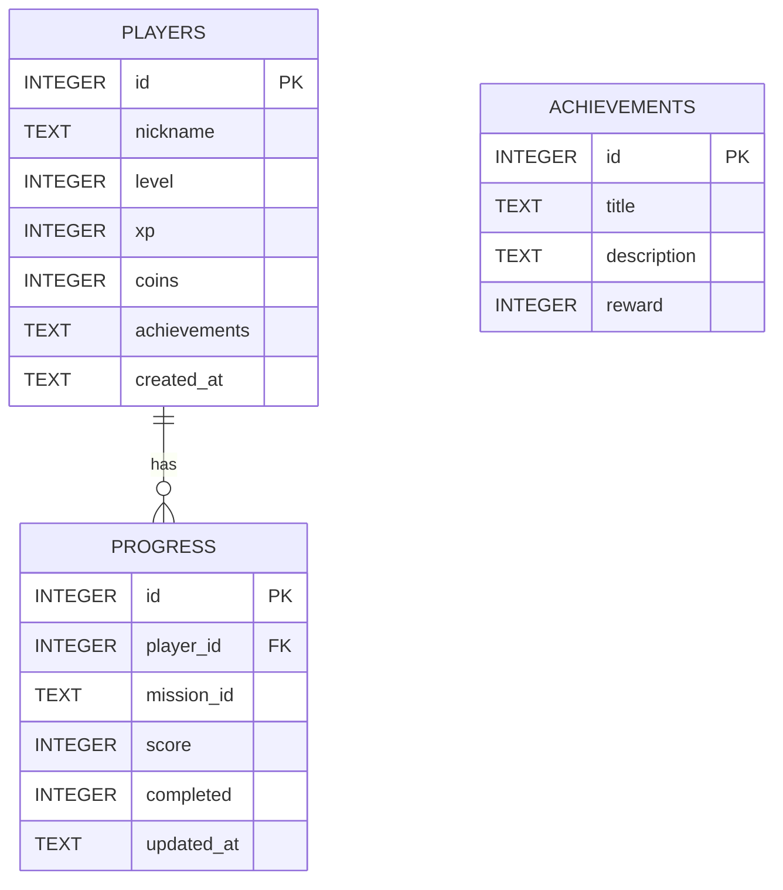

# Database Schema

## ER Overview

## Tables

### players

- `id`: primary key
- `nickname`: ชื่อเล่นของผู้เล่น
- `level`: ระดับปัจจุบัน
- `xp`: คะแนนสะสม
- `coins`: เหรียญสะสม
- `achievements`: JSON string ของ achievement ที่ปลดล็อกแล้ว
- `created_at`: วันเวลาสร้างผู้เล่น

### progress

- `id`: primary key
- `player_id`: foreign key ไปยัง players
- `mission_id`: รหัสด่าน
- `score`: คะแนนล่าสุด
- `completed`: 0 หรือ 1
- `updated_at`: วันเวลาล่าสุดที่อัปเดต

### achievements

- `id`: primary key
- `title`: ชื่อ badge หรือ achievement
- `description`: คำอธิบาย
- `reward`: รางวัลที่ได้รับ

## Seed Data

- ผู้เล่นตัวอย่าง 3 คน
- achievement ตัวอย่าง 4 รายการ
- progress ตัวอย่างสำหรับหลายด่าน
