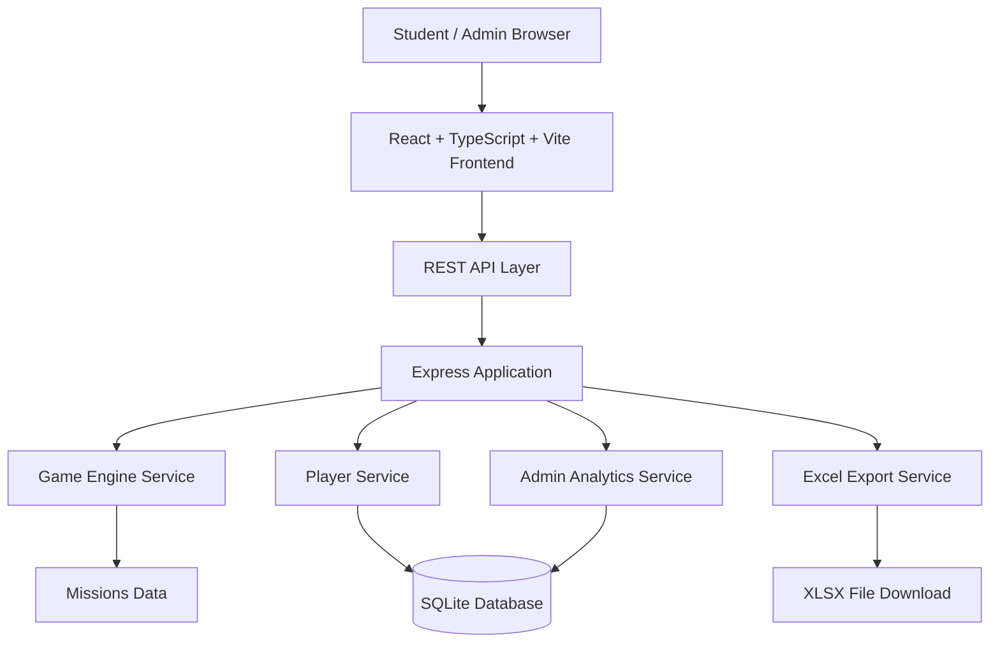

# System Architecture Diagram

## Architecture Notes

- Frontend เป็น Single Page Application
- Backend ใช้ Express และแยก route ตาม domain
- SQLite ใช้สำหรับ prototype และ portfolio-friendly setup
- Game Engine ใช้ rule-based scoring เพื่อให้ demo ทำงานได้จริงโดยไม่พึ่ง external API
- เตรียม `serverless-http` handler สำหรับ deploy แบบ serverless
